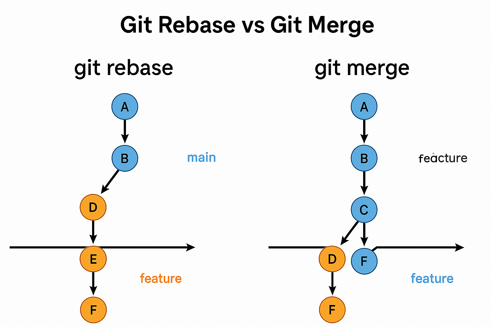

## Question  
What is the difference between `git rebase` and `git merge`? When would you use each?

### 📝 Short Explanation  
This question evaluates your understanding of how Git manages branch history and collaboration. It’s a common topic in interviews because both commands integrate changes from one branch to another — but they do it in very different ways.

## ✅ Answer  
- `git merge` integrates changes by creating a new merge commit, preserving the history of both branches.
- `git rebase` moves your branch on top of another, rewriting commit history to create a linear sequence.

### 📘 Detailed Explanation  
Let’s say you have two branches:
- `main`
- `feature` (branched off earlier from `main`)

#### 👉 Using `git merge`:
```bash
git checkout feature
git merge main
```

This pulls changes from `main` into `feature` and creates a **merge commit**, like this:
```
A---B---C (main)
     \
      D---E---F (feature)
             \
              G (merge commit)
```

**Pros:**
- Preserves full history and context
- Safer in teams: no history rewriting
- Good for long-lived shared branches

**Cons:**
- History becomes messy with many merge commits
- Harder to trace linear commit flow

---

#### 👉 Using `git rebase`:
```bash
git checkout feature
git rebase main
```

This **re-applies your commits on top of the latest `main`**, like this:
```
A---B---C (main)
             \
              D'---E'---F' (rebased feature)
```

**Pros:**
- Clean, linear history
- Easier to `git log` and `git bisect`
- Preferred before merging short-lived branches into main

**Cons:**
- Rewrites commit history
- Risky if already pushed and others have based work on it
- Not ideal for shared/public branches

---

### 🧠 When to Use What

| Use `merge` when...            | Use `rebase` when...                  |
|-------------------------------|---------------------------------------|
| You're collaborating on shared branches | You're working alone or before a PR merge |
| You want to preserve commit context     | You want a clean, linear history          |
| History safety is a concern             | You're cleaning up before pushing         |

> Summary:  
> Use `merge` to combine, use `rebase` to simplify.

---



